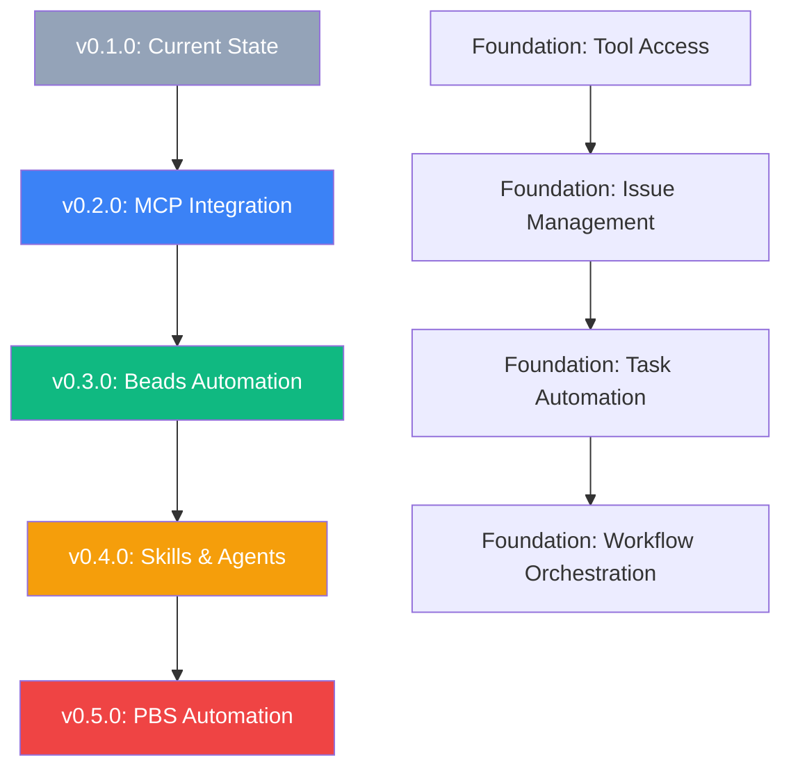

# 🏗️ Implementation Phases and Dependencies

> **Master execution guide for KareTech Stack AI workflow transformation**
> **From:** v0.1.0 (AI-ready structure) **To:** v0.5.0 (Full PBS automation)
> **Timeline:** 21 weeks, 142 development days, $293k investment

---

## 📊 **Executive Overview**

This document provides the master implementation roadmap for transforming KareTech Stack from providing "AI-ready structure" to delivering "fully automated AI workflows." It synthesizes all planning documents into a clear execution strategy with phases, dependencies, and decision points.

### 🎯 **Transformation Goal**

**Current State (v0.1.0):**
```bash
bunx create-karetech-stack my-app --preset saas
cd my-app
# ✅ Great project scaffolding (2 minutes vs 30+ manual)
# ✅ Professional themes and DevOps ready
# 📋 PBS documentation and .claude/ structure provided
# ⚙️ Manual AI configuration required (30+ minutes)
```

**Target State (v0.5.0):**
```bash
bunx create-karetech-stack my-app --preset saas
cd my-app

# ✅ Everything from v0.1.0
# ✅ AI tools work immediately (0 minutes setup)
# ✅ AI can manage entire development workflows
# 🚀 "Build user authentication" → Complete feature delivered autonomously
```

---

## 🗺️ **Phase Architecture and Dependencies**



### 🔗 **Critical Dependency Chain**

<table>
<tr>
<th width="20%">📋 Phase</th>
<th width="30%">🎯 Core Foundation</th>
<th width="25%">⚠️ Critical Dependencies</th>
<th width="25%">🚫 Cannot Proceed Without</th>
</tr>
<tr>
<td><strong>v0.2.0</strong></td>
<td>AI tools can access project resources</td>
<td>MCP ecosystem stability</td>
<td>Working MCP protocol implementation</td>
</tr>
<tr>
<td><strong>v0.3.0</strong></td>
<td>AI can manage project workflows</td>
<td>v0.2.0 MCP integration</td>
<td>Functional Beads CLI, AI tool access</td>
</tr>
<tr>
<td><strong>v0.4.0</strong></td>
<td>AI can perform complex tasks</td>
<td>v0.3.0 workflow management</td>
<td>Issue tracking, tool integration working</td>
</tr>
<tr>
<td><strong>v0.5.0</strong></td>
<td>AI orchestrates complete workflows</td>
<td>v0.4.0 task automation</td>
<td>All skills/agents functional, stable AI APIs</td>
</tr>
</table>

---

## 📅 **Phase 1: v0.2.0 MCP Server Pre-configuration**

### 🎯 **Phase Objective**
Eliminate manual MCP server setup, providing immediate AI tool access to development resources.

### 📊 **Phase Metrics**
- **Duration:** 4 weeks (February 2026)
- **Effort:** 25 development days
- **Team:** Lead Developer + AI Integration Specialist (part-time)
- **Budget:** ~$60k

### 🔧 **Implementation Sequence**

#### **Week 1: Foundation (Days 1-7)**
**Critical Path:**
1. **MCP Server Registry** (Task 1.1) - 3 days
   - Research and catalog vetted MCP servers
   - Define server configuration interface
   - Create server capability matrix

**Dependencies:**
- MCP ecosystem research
- Server testing and validation
- Security assessment of third-party servers

#### **Week 2: Core Integration (Days 8-14)**
**Critical Path:**
2. **Auto-Installation System** (Task 1.2) - 5 days
   - Build installation automation
   - Create settings.json generation
   - Handle dependency management

**Dependencies:**
- Task 1.1 (Server Registry)
- npm/bun package management understanding
- EJS template system enhancement

#### **Week 3: Server Integrations (Days 15-21)**
**Parallel Work:**
3. **GitHub Integration** (Task 1.4) - 3 days
4. **Database Integration** (Task 1.5) - 4 days
5. **Filesystem Integration** (Task 1.6) - 2 days

**Dependencies:**
- Task 1.2 (Auto-Installation System)
- Access to MCP server APIs
- Authentication token management

#### **Week 4: Quality & Polish (Days 22-25)**
6. **Health Validation** (Task 1.3) - 2 days
7. **Playwright Integration** (Task 1.7) - 3 days
8. **Template Enhancement** (Task 1.8) - 2 days
9. **Environment Documentation** (Task 1.9) - 1 day

### ⚠️ **Phase Risks and Mitigation**

**High Risk:**
- **MCP Server Breaking Changes** - Pin versions, maintain fallbacks
- **Authentication Complexity** - Standardize token management patterns
- **Cross-Platform Compatibility** - Test on Windows, macOS, Linux

**Medium Risk:**
- **Performance Impact** - Benchmark server startup times
- **Error Handling** - Comprehensive error recovery for server failures

### ✅ **Phase Success Criteria**

**Technical:**
- [ ] Generated projects have functional MCP servers without manual configuration
- [ ] AI can immediately access GitHub, database, and project files
- [ ] Health validation catches and reports server issues

**Business:**
- [ ] Setup time for AI features reduced from 30+ minutes to 0 minutes
- [ ] 90%+ of test projects have working AI tool access
- [ ] User feedback indicates significant improvement in AI workflow adoption

**Go/No-Go for v0.3.0:**
- Must have: Working MCP integration for GitHub, database, filesystem
- Must have: Automated installation working across platforms
- Must have: Health validation preventing broken setups

---

## 📅 **Phase 2: v0.3.0 Beads Integration Automation**

### 🎯 **Phase Objective**
Automate issue tracking with Beads, providing AI-driven project management workflows out-of-the-box.

### 📊 **Phase Metrics**
- **Duration:** 3 weeks (March 2026)
- **Effort:** 21 development days
- **Team:** Lead Developer + AI Integration Specialist
- **Budget:** ~$45k

### 🔧 **Implementation Sequence**

#### **Week 1: Beads Foundation (Days 1-7)**
**Critical Path:**
1. **Beads CLI Integration** (Task 2.1) - 3 days
   - Detect Beads CLI availability
   - Implement auto-installation fallbacks
   - Handle different environment configurations

**Dependencies:**
- v0.2.0 MCP integration complete and stable
- Beads CLI API understanding
- Cross-platform CLI detection

#### **Week 2: Templates and Workflows (Days 8-14)**
**Sequential Work:**
2. **Issue Template System** (Task 2.2) - 4 days
   - Design template format and structure
   - Create preset-agnostic base templates
   - Implement template generation system

3. **PBS Workflow Integration** (Task 2.3) - 5 days
   - Map PBS methodology to Beads workflows
   - Create workflow automation triggers
   - Design phase transition logic

**Dependencies:**
- Task 2.1 (Beads CLI Integration)
- Understanding of PBS methodology from existing docs
- Beads workflow system capabilities

#### **Week 3: Customization and Validation (Days 15-21)**
**Parallel Work:**
4. **Preset-Based Setup** (Task 2.4) - 4 days
5. **AI Agent Integration** (Task 2.5) - 3 days
6. **Setup Validation** (Task 2.6) - 2 days

**Dependencies:**
- Task 2.3 (PBS Workflow Integration)
- Understanding of preset-specific needs
- AI agent capability requirements for v0.4.0

### ⚠️ **Phase Risks and Mitigation**

**High Risk:**
- **Beads CLI Stability** - Pin Beads version, maintain compatibility layer
- **Workflow Complexity** - Start simple, expand iteratively
- **Cross-Platform Beads Installation** - Test thoroughly, provide manual fallbacks

**Medium Risk:**
- **Template Maintenance** - Version templates, automated testing
- **Performance Impact** - Optimize Beads initialization time

### ✅ **Phase Success Criteria**

**Technical:**
- [ ] `bd init` runs automatically during project generation with 95%+ success
- [ ] Generated projects have functional PBS workflows
- [ ] AI agents can create and manage issues automatically

**Business:**
- [ ] Users can immediately start issue-driven development
- [ ] Preset-specific workflows provide clear value
- [ ] AI workflow adoption increases significantly

**Go/No-Go for v0.4.0:**
- Must have: Beads integration working reliably across platforms
- Must have: PBS workflows functional and useful
- Must have: Foundation for AI agent issue management

---

## 📅 **Phase 3: v0.4.0 Skills Library & Pre-built Agents**

### 🎯 **Phase Objective**
Provide pre-built skills and AI agents for common development workflows, eliminating manual agent configuration.

### 📊 **Phase Metrics**
- **Duration:** 6 weeks (April 2026)
- **Effort:** 38 development days
- **Team:** Lead Developer + AI Specialist + DevOps Engineer (part-time)
- **Budget:** ~$85k

### 🔧 **Implementation Sequence**

#### **Weeks 1-2: Skills Infrastructure (Days 1-14)**
**Sequential Critical Path:**
1. **Skills Registry System** (Task 3.1) - 4 days
   - Design skill interface and metadata format
   - Build skill discovery and loading system
   - Create skill versioning and compatibility system

2. **Skill Installation System** (Task 3.2) - 5 days
   - Automate skill deployment during generation
   - Handle skill dependencies and conflicts
   - Create skill configuration management

**Dependencies:**
- v0.3.0 Beads workflows stable and functional
- Understanding of Claude Code skill system
- Agent architecture design decisions

#### **Weeks 3-4: Domain Skills Development (Days 15-28)**
**Parallel Skill Development:**
3. **Database Management Skills** (Task 3.3) - 6 days
4. **Testing Automation Skills** (Task 3.4) - 5 days
5. **API Development Skills** (Task 3.6) - 4 days

**Dependencies:**
- Task 3.2 (Skill Installation System)
- Domain expertise in each area
- Integration with existing project templates

#### **Weeks 5-6: Agents and Deployment (Days 29-38)**
**Sequential Integration:**
6. **Deployment Skills** (Task 3.5) - 5 days
7. **Specialized Agent Templates** (Task 3.7) - 6 days
8. **Agent Configuration System** (Task 3.8) - 3 days

**Dependencies:**
- All skill tasks (Tasks 3.3-3.6)
- Agent architecture finalized
- Claude Code integration patterns

### ⚠️ **Phase Risks and Mitigation**

**High Risk:**
- **Skill Complexity Management** - Start simple, expand carefully
- **Agent Coordination** - Clear separation of concerns, avoid conflicts
- **Performance with Multiple Skills** - Lazy loading, resource management

**Medium Risk:**
- **Skill Maintenance Burden** - Automated testing, community contributions
- **Cross-Project Compatibility** - Standardize skill interfaces

### ✅ **Phase Success Criteria**

**Technical:**
- [ ] AI agents work immediately without configuration
- [ ] Skills library covers 80%+ of common development tasks
- [ ] Agent coordination works without conflicts

**Business:**
- [ ] Users report significant productivity gains from AI automation
- [ ] Support requests for AI setup approach zero
- [ ] Community begins contributing skills and agents

**Go/No-Go for v0.5.0:**
- Must have: Stable skills library with core domains covered
- Must have: Agents functioning reliably across different project types
- Must have: Foundation for workflow orchestration

---

## 📅 **Phase 4: v0.5.0 Complete PBS Automation**

### 🎯 **Phase Objective**
Implement complete Plan-Build-Ship automation with AI orchestration for end-to-end development workflows.

### 📊 **Phase Metrics**
- **Duration:** 8 weeks (May 2026)
- **Effort:** 58 development days
- **Team:** Full team (Lead + AI Specialist + DevOps + QA)
- **Budget:** ~$130k

### 🔧 **Implementation Sequence**

#### **Weeks 1-2: Orchestration Core (Days 1-16)**
**Critical Foundation:**
1. **Workflow Orchestrator Engine** (Task 4.1) - 8 days
   - Multi-agent state management
   - Communication protocols between agents
   - Error handling and recovery mechanisms

2. **Plan Phase Automation** (Task 4.2) - 6 days
   - Requirements analysis automation
   - Technical architecture generation
   - Risk assessment and planning

**Dependencies:**
- v0.4.0 skills and agents stable and performant
- Advanced AI API access (Claude, GPT, Gemini)
- Orchestration architecture design

#### **Weeks 3-5: Phase Automation (Days 17-38)**
**Sequential PBS Implementation:**
3. **Build Phase Automation** (Task 4.3) - 10 days
   - Code generation coordination
   - Testing automation integration
   - Quality assurance workflows

4. **Ship Phase Automation** (Task 4.4) - 7 days
   - Deployment orchestration
   - Monitoring and rollback systems
   - Post-deployment validation

**Dependencies:**
- Task 4.2 (Plan Phase Automation)
- Integration with all v0.4.0 skills and agents
- Robust error handling and rollback capabilities

#### **Weeks 6-7: Advanced AI Features (Days 39-52)**
**Parallel Enhancement:**
5. **Multi-Model Support** (Task 4.5) - 5 days
6. **Advanced Context Management** (Task 4.6) - 4 days
7. **Learning System** (Task 4.7) - 6 days

**Dependencies:**
- Task 4.4 (Ship Phase Automation)
- Access to multiple AI models and APIs
- Long-term storage and learning infrastructure

#### **Week 8: Quality and Launch (Days 53-58)**
**Final Validation:**
8. **End-to-End Testing** (Task 4.8) - 5 days
9. **Performance Optimization** (Task 4.9) - 3 days
10. **Documentation and Launch Prep** (Task 4.10) - 4 days

### ⚠️ **Phase Risks and Mitigation**

**Critical Risk:**
- **Orchestration Complexity** - Extensive testing, gradual rollout, kill switches
- **AI API Reliability** - Multi-model fallbacks, graceful degradation
- **User Trust in Automation** - Transparent operation, easy override mechanisms

**High Risk:**
- **Performance at Scale** - Load testing, resource optimization
- **Learning System Safety** - Careful validation, human oversight requirements

### ✅ **Phase Success Criteria**

**Technical:**
- [ ] Complete features delivered from single user prompts
- [ ] 90%+ workflow automation with human oversight
- [ ] Learning system improves success rates over time

**Business:**
- [ ] Hours to production instead of weeks for common features
- [ ] Revolutionary improvement in development velocity
- [ ] Industry recognition as first AI-orchestrated development platform

**Launch Criteria:**
- Must have: Stable end-to-end workflow automation
- Must have: Safe learning system with oversight
- Must have: Exceptional user experience and documentation

---

## 🔄 **Cross-Phase Dependencies and Coordination**

### 🎯 **Technical Dependencies**

<table>
<tr>
<th width="20%">🔗 Dependency Type</th>
<th width="30%">📋 Description</th>
<th width="25%">⚠️ Risk Level</th>
<th width="25%">🛡️ Mitigation Strategy</th>
</tr>
<tr>
<td><strong>MCP Protocol Stability</strong></td>
<td>All phases depend on MCP remaining stable and backward-compatible</td>
<td>HIGH</td>
<td>Version pinning, protocol abstraction layer, fallback mechanisms</td>
</tr>
<tr>
<td><strong>AI API Access</strong></td>
<td>Advanced features require reliable access to Claude, GPT, Gemini APIs</td>
<td>HIGH</td>
<td>Multi-provider strategy, local model fallbacks, graceful degradation</td>
</tr>
<tr>
<td><strong>Beads CLI Evolution</strong></td>
<td>Workflow features depend on Beads remaining compatible</td>
<td>MEDIUM</td>
<td>Close collaboration with Beads team, compatibility testing</td>
</tr>
<tr>
<td><strong>Better-T-Stack Changes</strong></td>
<td>Core functionality depends on stable Better-T-Stack foundation</td>
<td>LOW</td>
<td>Forked foundation, controlled integration of upstream changes</td>
</tr>
</table>

### 🤝 **Team Coordination Requirements**

**Critical Handoffs:**
- **v0.2.0 → v0.3.0:** MCP integration must be stable before Beads work begins
- **v0.3.0 → v0.4.0:** Workflow foundation must support skill integration
- **v0.4.0 → v0.5.0:** Skills and agents must be orchestration-ready

**Communication Protocols:**
- **Weekly sync meetings** during active development
- **Phase gate reviews** before major transitions
- **Technical documentation** maintained in real-time
- **Risk escalation** procedures for blocking issues

### 📊 **Resource Dependencies**

**Development Environment:**
- **AI API budgets** escalating with advanced features
- **Testing infrastructure** for multi-agent workflows
- **Performance testing** capabilities for orchestration load

**External Dependencies:**
- **MCP server ecosystem** health and growth
- **AI model capabilities** continuing to improve
- **Developer community** adoption and feedback

---

## 🎯 **Decision Points and Go/No-Go Gates**

### 🚦 **Phase Gate Criteria**

Each phase has mandatory gates that must be passed before proceeding:

#### **v0.2.0 Gate: MCP Foundation**
**Go Criteria:**
- ✅ MCP servers install automatically across platforms
- ✅ AI can access GitHub, database, filesystem without configuration
- ✅ Health validation catches and recovers from failures
- ✅ Performance impact < 10% on project generation time

**No-Go Scenarios:**
- ❌ MCP integration unreliable (< 85% success rate)
- ❌ Significant performance degradation
- ❌ Security vulnerabilities in auto-configuration

#### **v0.3.0 Gate: Workflow Foundation**
**Go Criteria:**
- ✅ Beads integration works automatically
- ✅ PBS workflows provide clear value to users
- ✅ AI can create and manage issues reliably
- ✅ Foundation supports skill and agent integration

**No-Go Scenarios:**
- ❌ Beads reliability issues
- ❌ Workflow complexity overwhelming users
- ❌ Agent integration architecture inadequate

#### **v0.4.0 Gate: Automation Readiness**
**Go Criteria:**
- ✅ Skills library covers core development tasks
- ✅ Agents function reliably without conflicts
- ✅ Performance with multiple agents acceptable
- ✅ Foundation ready for orchestration

**No-Go Scenarios:**
- ❌ Agent coordination problems
- ❌ Skill maintenance burden too high
- ❌ User adoption of automation features low

#### **v0.5.0 Gate: Full Automation**
**Go Criteria:**
- ✅ End-to-end workflows function reliably
- ✅ Learning system improves outcomes
- ✅ User trust and satisfaction high
- ✅ Revolutionary improvement in development velocity

**No-Go Scenarios:**
- ❌ Automation unreliable or unsafe
- ❌ User experience degraded
- ❌ Performance issues at scale

### 🔀 **Pivot Options**

**If v0.2.0 fails:** Focus on manual but easier MCP setup
**If v0.3.0 fails:** Alternative issue tracking integration (GitHub Issues, Jira)
**If v0.4.0 fails:** Simplified skill system, fewer agents
**If v0.5.0 fails:** Partial automation with manual oversight

---

## 📈 **Success Metrics and Monitoring**

### 🎯 **Phase-Specific KPIs**

#### **v0.2.0 Success Metrics**
- **Setup Time Reduction:** 30+ minutes → 0 minutes (AI tool access)
- **Success Rate:** 90%+ projects have working MCP integration
- **User Satisfaction:** NPS increase from AI workflow adoption
- **Support Burden:** 80% reduction in AI setup support requests

#### **v0.3.0 Success Metrics**
- **Workflow Adoption:** 70%+ users actively use Beads workflows
- **Issue Management:** AI creates 50%+ of project issues automatically
- **Development Velocity:** 25% faster feature completion with workflows
- **User Engagement:** Increased session time in generated projects

#### **v0.4.0 Success Metrics**
- **Task Automation:** AI handles 80%+ of common development tasks
- **Agent Utilization:** 60%+ daily active agent usage
- **Productivity Gains:** 40% faster development cycles
- **Community Growth:** Community-contributed skills and agents

#### **v0.5.0 Success Metrics**
- **Workflow Automation:** 90%+ automation of complete feature delivery
- **Time to Production:** Hours instead of weeks for common features
- **Learning Effectiveness:** Measurable improvement in success rates
- **Industry Impact:** Recognition as AI-first development platform

### 📊 **Continuous Monitoring**

**Technical Metrics:**
- API response times and error rates
- Agent performance and coordination efficiency
- Resource usage and scalability metrics
- Security and reliability monitoring

**Business Metrics:**
- User acquisition and retention
- Feature adoption rates
- Support ticket volume and resolution time
- Community engagement and contributions

**Product Metrics:**
- User satisfaction scores (NPS, CSAT)
- Feature usage analytics
- Time-to-value measurements
- Competitive differentiation tracking

---

## 🚀 **Launch and Rollout Strategy**

### 🎪 **Progressive Rollout Plan**

#### **Alpha Phase (Internal Testing)**
- **Team:** Internal development team
- **Duration:** 2 weeks per version
- **Focus:** Core functionality validation
- **Criteria:** Feature completeness, basic stability

#### **Beta Phase (Limited Release)**
- **Team:** 50-100 selected early adopters
- **Duration:** 4 weeks per version
- **Focus:** User experience, edge case discovery
- **Criteria:** User satisfaction, reliability improvements

#### **General Availability**
- **Team:** Full community release
- **Duration:** Ongoing
- **Focus:** Scale, performance, community growth
- **Criteria:** Production readiness, documentation completeness

### 📢 **Marketing and Communication**

**v0.2.0 Launch:**
- **Message:** "Zero-configuration AI development workflows"
- **Channels:** Technical blogs, developer communities
- **Content:** MCP integration tutorials, productivity comparisons

**v0.3.0 Launch:**
- **Message:** "AI-driven project management out-of-the-box"
- **Channels:** Project management communities, development podcasts
- **Content:** PBS workflow demonstrations, case studies

**v0.4.0 Launch:**
- **Message:** "AI agents handle 80% of development tasks"
- **Channels:** AI/ML communities, developer conferences
- **Content:** Agent demonstrations, productivity metrics

**v0.5.0 Launch:**
- **Message:** "First AI-orchestrated development platform"
- **Channels:** Major tech media, conference keynotes
- **Content:** Revolutionary workflow demonstrations, industry analysis

---

## 🏁 **Execution Summary**

### 📊 **Complete Implementation Overview**

<table>
<tr>
<th width="15%">📅 Phase</th>
<th width="20%">🎯 Core Capability</th>
<th width="15%">⏱️ Duration</th>
<th width="15%">💰 Investment</th>
<th width="35%">🚀 User Impact</th>
</tr>
<tr>
<td><strong>v0.2.0</strong></td>
<td>AI tools work immediately</td>
<td>4 weeks</td>
<td>$60k</td>
<td>Zero AI setup time, immediate tool access</td>
</tr>
<tr>
<td><strong>v0.3.0</strong></td>
<td>AI-driven project management</td>
<td>3 weeks</td>
<td>$45k</td>
<td>Automated workflows, issue management</td>
</tr>
<tr>
<td><strong>v0.4.0</strong></td>
<td>AI handles 80% of dev tasks</td>
<td>6 weeks</td>
<td>$85k</td>
<td>Massive productivity gains, task automation</td>
</tr>
<tr>
<td><strong>v0.5.0</strong></td>
<td>Complete workflow orchestration</td>
<td>8 weeks</td>
<td>$130k</td>
<td>Revolutionary development experience</td>
</tr>
<tr>
<td><strong>Total</strong></td>
<td><strong>AI-first development platform</strong></td>
<td><strong>21 weeks</strong></td>
<td><strong>$320k</strong></td>
<td><strong>Hours to production vs weeks</strong></td>
</tr>
</table>

### 🎯 **Critical Success Factors**

1. **Technical Excellence:** Each phase must be stable before the next begins
2. **User-Centric Design:** Continuous user feedback and experience optimization
3. **Community Building:** Early adopter engagement and contribution encouragement
4. **Risk Management:** Proactive identification and mitigation of technical risks
5. **Market Timing:** Capitalize on AI development trends while maintaining quality

### 🌟 **Vision Realization**

By the end of this implementation plan, KareTech Stack will achieve its vision of becoming the **world's first AI-orchestrated development platform**, where:

> **Developers describe what they want to build, and AI autonomously executes the complete Plan-Build-Ship workflow, delivering production-ready features with minimal human intervention.**

This transformation will position KareTech Stack as the leader in AI-first development tooling, providing unprecedented developer productivity and setting the standard for the future of software development.

---

## 📚 **Reference Documents**

**Master Planning Documents:**
- [AI Workflow Implementation Plan](AI_WORKFLOW_IMPLEMENTATION_PLAN.md) - Complete technical breakdown
- [Beads Issues Creation](BEADS_ISSUES_CREATION.md) - 30 development tracking issues
- [GitHub Issues Creation](GITHUB_ISSUES_CREATION.md) - 8 community engagement issues

**Project Context:**
- [README.md](../README.md) - Honest capability assessment
- [PROJECT_STATUS.md](PROJECT_STATUS.md) - Current state and progress
- [CLAUDE.md](../CLAUDE.md) - AI development entry point

**Implementation Foundation:**
- [PBS_MASTER_SYSTEM.md](PBS_MASTER_SYSTEM.md) - Plan-Build-Ship methodology
- [constitution.md](../constitution.md) - Immutable project principles

---

*Implementation Phases and Dependencies v1.0 - January 10, 2026*
*Master execution guide: 21 weeks, $320k investment, revolutionary AI workflows*